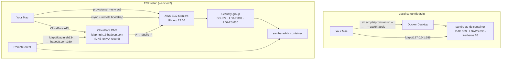

# Samba Active Directory

A self-contained Samba AD domain controller for development and lab use. One script provisions either **local Docker on your Mac** or a **remote EC2 instance** with Cloudflare DNS — same domain, users, and groups in both environments.


## Overview

| | Local (default) | EC2 |
|---|----------------|-----|
| **Command** | `sh scripts/provision.sh --action apply` | `sh scripts/provision.sh --action apply --env ec2` |
| **Where AD runs** | Docker on your Mac | Docker on AWS t3.micro (Ubuntu 22.04) |
| **LDAP URL** | `ldap://127.0.0.1:389` | `ldap://ldap.nrsh13-hadoop.com:389` |
| **Reachable from** | This Mac only | Anywhere (security group + DNS) |
| **Prerequisites** | Docker Desktop | AWS CLI, SSH key, Cloudflare API token |
| **Typical use** | Local dev / Kafka LDAP auth testing | Shared lab DC reachable by remote clients |

Both paths use the same `scripts/provision.sh` entry point. EC2 support files live under `ec2/` and are invoked automatically when `--env ec2` is set.

---

## Architecture



### EC2 apply flow (what happens under the hood)

1. **Your Mac** runs `scripts/provision.sh --action apply --env ec2`
2. **AWS** — creates/reuses key pair, security group, and t3.micro instance (`ec2/provision-ec2.sh`)
3. **User-data** — instance bootstraps Docker and swap (`ec2/scripts/user-data.sh`)
4. **Rsync** — repo copied to `/opt/active_directory` on the instance (`ec2/scripts/sync-and-bootstrap.sh`)
5. **Remote bootstrap** — runs the same local Docker provision on the instance (`ec2/scripts/remote-bootstrap.sh` → `scripts/provision.sh --action apply`)
6. **Cloudflare** — creates/updates DNS-only A record `ldap.nrsh13-hadoop.com` → EC2 public IP (`ec2/scripts/setup-cloudflare-dns.sh`)
7. **State** — instance metadata saved to `ec2/state/instance.env`

LDAP uses a **direct DNS A record** (not a Cloudflare Tunnel). Clients connect to port 389 on the EC2 public IP via the hostname — no `cloudflared` needed on client machines.

---

## Quick start

### Local (Mac + Docker)

```bash
cp .env.example .env          # customize passwords if needed
sh scripts/provision.sh --action apply
```

### EC2 (AWS + Cloudflare)

```bash
# Prerequisites: AWS CLI configured, SSH key at ~/.ssh/id_rsa, Cloudflare token with DNS Edit
export CLOUDFLARE_API_TOKEN='your-token'
cp ec2/config.env.example ec2/config.env   # optional — defaults are fine for first run
sh scripts/provision.sh --action apply --env ec2
```

First EC2 apply takes about **5–8 minutes** (instance launch, Docker install, Samba provision, DNS).

---

## Commands

Run `sh scripts/provision.sh` with no arguments for built-in help.

| Action | Local | EC2 |
|--------|-------|-----|
| **Apply** (create/provision) | `sh scripts/provision.sh --action apply` | `sh scripts/provision.sh --action apply --env ec2` |
| **Destroy** (tear down) | `sh scripts/provision.sh --action destroy` | `sh scripts/provision.sh --action destroy --env ec2` |
| **Sync** (re-rsync repo + re-apply) | — | `sh scripts/provision.sh --action sync --env ec2` |

**Flags**

| Flag | Values | Default | Description |
|------|--------|---------|-------------|
| `--action` | `apply`, `destroy`, `sync` | *(required)* | What to do |
| `--env` | `local`, `ec2` | `local` | Target environment |
| `--help` | — | — | Show help |

---

## Prerequisites

### Local

- [Docker Desktop](https://www.docker.com/products/docker-desktop/) (running)
- `ldapsearch` for testing: `brew install openldap`
- Bash (script re-execs itself if invoked as `sh`)

### EC2

- [AWS CLI](https://aws.amazon.com/cli/) configured (`aws sts get-caller-identity` works)
- SSH key pair (default: `~/.ssh/id_rsa` and `~/.ssh/id_rsa.pub`)
- [Cloudflare API token](https://developers.cloudflare.com/fundamentals/api/get-started/create-token/) with **DNS Edit** on zone `nrsh13-hadoop.com`
- `rsync` (pre-installed on macOS)
- Export before apply: `export CLOUDFLARE_API_TOKEN='…'`

---

## Configuration

### Local — `.env`

Copy `.env.example` to `.env` (git-ignored). Key settings:

| Variable | Default | Description |
|----------|---------|-------------|
| `DOMAIN` | `NRSH13-HADOOP` | NetBIOS domain name |
| `REALM` | `NRSH13-HADOOP.COM` | Kerberos realm |
| `DNS_DOMAIN` | `nrsh13-hadoop.com` | DNS domain |
| `ADMIN_PASS` | `Dummy@2929` | Domain Administrator password |
| `USER_NAME` / `USER2_NAME` | `768019` / `768020` | Test user accounts |
| `USER_PASS` / `USER2_PASS` | `Dummy@2929` | User passwords |
| `GROUP_NAME` | `A_HADOOP_ADMINS` | AD group |
| `SECOND_GROUP_NAME` | `A_Kafka_Users_Dev` | Second AD group |
| `CONTAINER_NAME` | `samba-ad-dc` | Docker container name |
| `CERT_DIR` | *(auto-detect)* | Optional TLS certs for LDAPS |

### EC2 — `ec2/config.env`

Auto-created from `ec2/config.env.example` on first run (git-ignored):

| Variable | Default | Description |
|----------|---------|-------------|
| `AWS_REGION` | `ap-southeast-2` | AWS region |
| `INSTANCE_TYPE` | `t3.micro` | EC2 instance type (free tier) |
| `PROJECT_NAME` | `samba-ad-dc` | Instance tag / resource prefix |
| `KEY_NAME` | `samba-ad-dc` | AWS key pair name |
| `SSH_USER` | `ubuntu` | SSH login user |
| `SSH_PUBLIC_KEY_FILE` | `~/.ssh/id_rsa.pub` | Public key to import |
| `SSH_PRIVATE_KEY_PATH` | `~/.ssh/id_rsa` | Private key for SSH/rsync |
| `ADMIN_SSH_CIDR` | *your public IP/32* | SSH ingress (auto-detected) |
| `LDAP_INGRESS_CIDR` | `0.0.0.0/0` | LDAP/LDAPS ingress |

### Cloudflare (EC2 only)

| Variable | Default | Description |
|----------|---------|-------------|
| `CLOUDFLARE_API_TOKEN` | *(required)* | API token with DNS Edit |
| `CLOUDFLARE_ZONE_NAME` | `nrsh13-hadoop.com` | DNS zone |
| `CLOUDFLARE_LDAP_HOSTNAME` | `ldap.nrsh13-hadoop.com` | LDAP hostname (A record) |

---

## What gets provisioned

On **apply** (local or on the EC2 instance), the script:

1. Builds the Samba AD DC Docker image (`Dockerfile` — Debian + `samba-ad-dc`)
2. Starts the container via `docker-compose.yml`
3. Provisions the AD domain (`samba-tool domain provision`) if not already present
4. Optionally installs TLS certificates for LDAPS
5. Sets the Administrator password
6. Creates users **768019** and **768020**
7. Creates groups **A_HADOOP_ADMINS** and **A_Kafka_Users_Dev**, adds both users to both groups
8. Verifies LDAP with an internal `ldapsearch`

**Exposed ports** (local and EC2): 389 (LDAP), 636 (LDAPS), 88/464 (Kerberos), 139/445 (SMB).

---

## Test LDAP

### EC2 (from anywhere)

```bash
ldapsearch -LLL \
  -H ldap://ldap.nrsh13-hadoop.com:389 \
  -x \
  -D "CN=Administrator,CN=Users,DC=nrsh13-hadoop,DC=com" \
  -w 'Dummy@2929' \
  -b "DC=nrsh13-hadoop,DC=com" \
  "(sAMAccountName=768019)"
```

### Local (this Mac only)

```bash
ldapsearch -LLL \
  -H ldap://127.0.0.1:389 \
  -x \
  -D "CN=Administrator,CN=Users,DC=nrsh13-hadoop,DC=com" \
  -w 'Dummy@2929' \
  -b "DC=nrsh13-hadoop,DC=com" \
  "(sAMAccountName=768019)"
```

### Connection summary

| Setting | Value |
|---------|-------|
| **LDAP URL (EC2)** | `ldap://ldap.nrsh13-hadoop.com:389` |
| **LDAP URL (local)** | `ldap://127.0.0.1:389` |
| **LDAPS** | port 636 (when TLS certs are installed) |
| **Bind DN** | `CN=Administrator,CN=Users,DC=nrsh13-hadoop,DC=com` |
| **Base DN** | `DC=nrsh13-hadoop,DC=com` |
| **Users base** | `CN=Users,DC=nrsh13-hadoop,DC=com` |
| **Administrator password** | `Dummy@2929` (change in `.env`) |
| **Test users** | `768019`, `768020` |

---

## Repository layout

```
active_directory/
├── scripts/
│   ├── provision.sh          # Single entry point (local + EC2)
│   └── terminal-colors.sh    # Shared logging helpers
├── ec2/
│   ├── provision-ec2.sh      # EC2 logic (sourced by provision.sh)
│   ├── config.env.example    # EC2 settings template
│   ├── state/instance.env    # Written after EC2 apply (git-ignored)
│   └── scripts/
│       ├── user-data.sh              # EC2 launch: Docker + swap
│       ├── sync-and-bootstrap.sh     # Rsync repo to instance
│       ├── remote-bootstrap.sh       # Runs local provision on EC2
│       └── setup-cloudflare-dns.sh   # DNS-only A record
├── docs/images/
│   └── architecture-diagram.png
├── Dockerfile                # Samba AD DC image
├── docker-compose.yml
├── .env.example              # Local settings template
└── README.md
```

---

## EC2 operations

### SSH to the instance

After apply, state is in `ec2/state/instance.env`:

```bash
source ec2/state/instance.env
ssh -i "$SSH_PRIVATE_KEY_PATH" "${SSH_USER}@${PUBLIC_IP}"
```

### Re-sync after code changes

Pushes the repo to the instance and re-runs Samba provision:

```bash
sh scripts/provision.sh --action sync --env ec2
```

### Destroy EC2 resources

Terminates the instance and removes local state. Does **not** delete the Cloudflare DNS record or AWS key pair/security group.

```bash
sh scripts/provision.sh --action destroy --env ec2
```

### Destroy local Docker

Stops containers and removes volumes (Samba data is deleted):

```bash
sh scripts/provision.sh --action destroy
```

---

## Troubleshooting

| Problem | Check |
|---------|-------|
| `CLOUDFLARE_API_TOKEN is not set` | `export CLOUDFLARE_API_TOKEN='…'` before EC2 apply |
| LDAP timeout on EC2 | Security group allows 389 from your IP; DNS A record points to current public IP (`sync` refreshes DNS) |
| LDAP works locally but not remotely | Local binds to `127.0.0.1` only from outside — use EC2 or ensure compose publishes `0.0.0.0:389` |
| SSH timeout on new instance | Wait 2–3 min; check `ADMIN_SSH_CIDR` matches your IP in `ec2/config.env` |
| `docker compose` not found | Install Docker Desktop (local) or wait for user-data to finish (EC2) |
| EC2 out of memory | user-data adds swap; t3.micro is tight — avoid heavy parallel workloads |

**Logs on EC2 instance:**

```bash
docker logs samba-ad-dc
sudo cat /var/log/samba.log   # inside container via docker exec
```

---

## Security notes

- Default passwords (`Dummy@2929`) are for **lab use only** — change in `.env` before any real deployment.
- `LDAP_INGRESS_CIDR=0.0.0.0/0` opens LDAP to the internet on EC2. Restrict to your office/VPN CIDR in `ec2/config.env` for production-like setups.
- Never commit `.env`, `ec2/config.env`, or `ec2/state/instance.env`.
- Cloudflare record is **DNS-only** (grey cloud) — LDAP traffic goes directly to EC2, not through Cloudflare proxy.

---

## License

Internal lab tooling for NRSH13-ORG. Use at your own risk.
