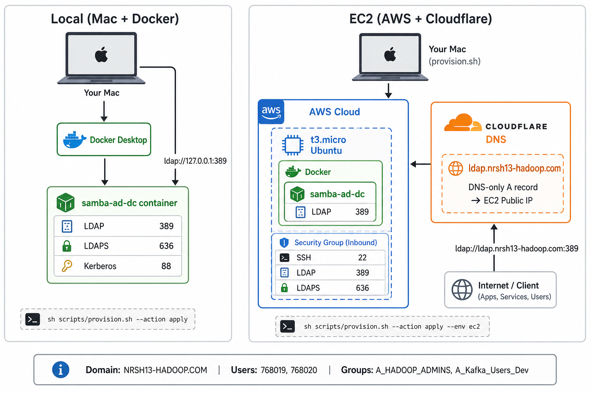

# Samba Active Directory

A self-contained Samba AD domain controller for development and lab use. One script provisions either **local Docker on your Mac** or a **remote EC2 instance** with Cloudflare Zero Trust tunnel — same domain, users, and groups in both environments.



## Architecture

| Path | Flow |
|------|------|
| **Local** | Mac → Docker Desktop → `samba-ad-dc` container → `ldap://127.0.0.1:389` |
| **EC2** | Mac runs `provision.sh --env ec2` → AWS t3.micro → Docker → Samba AD → Cloudflare tunnel (HEALTHY) + DNS-only A record → `ldap://ldap.nrsh13-hadoop.com:389` |

Both paths use the same `scripts/provision.sh --action apply`. EC2 apply also rsyncs the repo, installs `cloudflared` on the instance, updates Cloudflare DNS, and flushes Mac local DNS (`/etc/hosts`).

## Overview

| | Local (default) | EC2 |
|---|----------------|-----|
| **Command** | `sh scripts/provision.sh --action apply` | `sh scripts/provision.sh --action apply --env ec2` |
| **Where AD runs** | Docker on your Mac | Docker on AWS t3.micro (Ubuntu 22.04) |
| **LDAP URL** | `ldap://127.0.0.1:389` | `ldap://ldap.nrsh13-hadoop.com:389` |
| **Reachable from** | This Mac only | Anywhere (Cloudflare tunnel + LDAP) |
| **Prerequisites** | Docker Desktop | AWS credentials, AWS CLI, SSH key, Cloudflare API token, Zero Trust tunnel `ldap` |
| **Typical use** | Local dev / Kafka LDAP auth testing | Shared lab DC reachable by remote clients |

Both paths use the same `scripts/provision.sh` entry point. EC2 support files live under `ec2/` and are invoked automatically when `--env ec2` is set.

Run `sh scripts/provision.sh` with no arguments for built-in help.

---

## Quick start

### Local (Mac + Docker)

```bash
cp .env.example .env          # customize passwords if needed
sh scripts/provision.sh --action apply
```

### EC2 (AWS + Cloudflare)

```bash
export AWS_ACCESS_KEY_ID='your-key-id'
export AWS_SECRET_ACCESS_KEY='your-secret-key'
export CLOUDFLARE_API_TOKEN='your-token'
cp ec2/config.env.example ec2/config.env   # optional — defaults are fine for first run
sh scripts/provision.sh --action apply --env ec2
```

**Re-run `apply`** on an existing instance anytime — it re-syncs the repo, re-provisions Samba AD, and refreshes tunnel/DNS/local Mac settings.

First EC2 apply takes about **10–20 minutes**. The script does not finish until:

1. Samba AD is running on EC2  
2. Cloudflare tunnel connector is **HEALTHY**  
3. DNS A record points to EC2  
4. Mac local DNS is updated (cache flush + `/etc/hosts`) — **sudo password prompted once**  
5. `ldapsearch` via `ldap.nrsh13-hadoop.com:389` succeeds for users **768019** and **768020**

---

## Prerequisites

### Local

- [Docker Desktop](https://www.docker.com/products/docker-desktop/) (running)
- `ldapsearch` for testing: `brew install openldap`
- Bash (script re-execs itself if invoked as `sh`)

### EC2

- [AWS CLI](https://aws.amazon.com/cli/) installed
- AWS credentials exported (or configured in `~/.aws/credentials`):

```bash
export AWS_ACCESS_KEY_ID='your-key-id'
export AWS_SECRET_ACCESS_KEY='your-secret-key'
```

- Verify: `aws sts get-caller-identity`
- SSH key pair (default: `~/.ssh/id_rsa` and `~/.ssh/id_rsa.pub`)
- [Cloudflare API token](https://developers.cloudflare.com/fundamentals/api/get-started/create-token/) with **DNS Edit** and **Cloudflare Tunnel Edit**
- Zero Trust tunnel **`ldap`** created in [Cloudflare Connectors](https://dash.cloudflare.com/3e691c68591ed154e625790a60361b78/one/networks/connectors) (TCP route `ldap.nrsh13-hadoop.com` → `localhost:389`)
- `rsync` (pre-installed on macOS)
- Export before apply: `export CLOUDFLARE_API_TOKEN='…'`

---

## Configuration

### Local — `.env`

Copy `.env.example` to `.env` (git-ignored). Key settings:

| Variable | Default | Description |
|----------|---------|-------------|
| `DOMAIN` | `NRSH13-HADOOP` | NetBIOS domain name |
| `REALM` | `NRSH13-HADOOP.COM` | Kerberos realm |
| `DNS_DOMAIN` | `nrsh13-hadoop.com` | DNS domain |
| `ADMIN_PASS` | `Dummy@2929` | Domain Administrator password |
| `USER_NAME` / `USER2_NAME` | `768019` / `768020` | Test user accounts |
| `USER_PASS` / `USER2_PASS` | `Dummy@2929` | User passwords |
| `GROUP_NAME` | `A_HADOOP_ADMINS` | AD group |
| `SECOND_GROUP_NAME` | `A_Kafka_Users_Dev` | Second AD group |
| `CONTAINER_NAME` | `samba-ad-dc` | Docker container name |
| `CERT_DIR` | *(auto-detect)* | Optional TLS certs for LDAPS |

### EC2 — `ec2/config.env`

Auto-created from `ec2/config.env.example` on first run (git-ignored):

| Variable | Default | Description |
|----------|---------|-------------|
| `AWS_REGION` | `ap-southeast-2` | AWS region |
| `INSTANCE_TYPE` | `t3.micro` | EC2 instance type (free tier) |
| `PROJECT_NAME` | `samba-ad-dc` | Instance tag / resource prefix |
| `KEY_NAME` | `samba-ad-dc` | AWS key pair name |
| `SSH_USER` | `ubuntu` | SSH login user |
| `SSH_PUBLIC_KEY_FILE` | `~/.ssh/id_rsa.pub` | Public key to import |
| `SSH_PRIVATE_KEY_PATH` | `~/.ssh/id_rsa` | Private key for SSH/rsync |
| `ADMIN_SSH_CIDR` | *your public IP/32* | SSH ingress (auto-detected) |
| `LDAP_INGRESS_CIDR` | `0.0.0.0/0` | LDAP/LDAPS ingress |

### Cloudflare (EC2 only)

| Variable | Default | Description |
|----------|---------|-------------|
| `CLOUDFLARE_API_TOKEN` | *(required)* | API token (DNS Edit + Tunnel Edit) |
| `CLOUDFLARE_ACCOUNT_ID` | `3e691c68591ed154e625790a60361b78` | Cloudflare account |
| `CLOUDFLARE_TUNNEL_NAME` | `ldap` | Zero Trust tunnel name |
| `CLOUDFLARE_TUNNEL_ID` | `8e89df70-…` | Tunnel UUID |
| `CLOUDFLARE_ZONE_NAME` | `nrsh13-hadoop.com` | DNS zone |
| `CLOUDFLARE_LDAP_HOSTNAME` | `ldap.nrsh13-hadoop.com` | LDAP hostname (tunnel route) |

---

## What gets provisioned

On **apply** (local or on the EC2 instance), the script:

1. Builds the Samba AD DC Docker image (`Dockerfile` — Debian + `samba-ad-dc`)
2. Starts the container via `docker-compose.yml`
3. Provisions the AD domain (`samba-tool domain provision`) if not already present
4. Optionally installs TLS certificates for LDAPS
5. Sets the Administrator password
6. Creates users **768019** and **768020**
7. Creates groups **A_HADOOP_ADMINS** and **A_Kafka_Users_Dev**, adds both users to both groups
8. Verifies LDAP with an internal `ldapsearch`

**Exposed ports** (local and EC2): 389 (LDAP), 636 (LDAPS), 88/464 (Kerberos), 139/445 (SMB).

---

## Test LDAP

### EC2 (from anywhere)

```bash
ldapsearch -LLL \
  -H ldap://ldap.nrsh13-hadoop.com:389 \
  -x \
  -D "CN=Administrator,CN=Users,DC=nrsh13-hadoop,DC=com" \
  -w 'Dummy@2929' \
  -b "DC=nrsh13-hadoop,DC=com" \
  "(sAMAccountName=768019)"
```

### Local (this Mac only)

```bash
ldapsearch -LLL \
  -H ldap://127.0.0.1:389 \
  -x \
  -D "CN=Administrator,CN=Users,DC=nrsh13-hadoop,DC=com" \
  -w 'Dummy@2929' \
  -b "DC=nrsh13-hadoop,DC=com" \
  "(sAMAccountName=768019)"
```

### Connection summary

| Setting | Value |
|---------|-------|
| **LDAP URL (EC2)** | `ldap://ldap.nrsh13-hadoop.com:389` |
| **LDAP URL (local)** | `ldap://127.0.0.1:389` |
| **LDAPS** | port 636 (when TLS certs are installed) |
| **Bind DN** | `CN=Administrator,CN=Users,DC=nrsh13-hadoop,DC=com` |
| **Base DN** | `DC=nrsh13-hadoop,DC=com` |
| **Users base** | `CN=Users,DC=nrsh13-hadoop,DC=com` |
| **Administrator password** | `Dummy@2929` (change in `.env`) |
| **Test users** | `768019`, `768020` |

---

## Repository layout

```
active_directory/
├── scripts/
│   ├── provision.sh          # Single entry point (local + EC2)
│   └── terminal-colors.sh    # Shared logging helpers
├── ec2/
│   ├── provision-ec2.sh      # EC2 logic (sourced by provision.sh)
│   ├── config.env.example    # EC2 settings template
│   ├── state/instance.env    # Written after EC2 apply (git-ignored)
│   └── scripts/
│       ├── user-data.sh              # EC2 launch: Docker + swap
│       ├── sync-and-bootstrap.sh     # Rsync repo to instance
│       ├── remote-bootstrap.sh       # Runs local provision on EC2
│       ├── setup-cloudflare-tunnel.sh # cloudflared + wait HEALTHY
│       ├── setup-cloudflare-dns.sh   # DNS-only A record
│       ├── ensure-local-ldap-dns.sh  # Mac cache flush + /etc/hosts
│       └── cleanup-local-ldap-dns.sh # remove /etc/hosts on destroy
├── docs/images/
│   └── architecture-diagram.png
├── Dockerfile                # Samba AD DC image
├── docker-compose.yml
├── .env.example              # Local settings template
└── README.md
```

---

## Verify Cloudflare tunnel (EC2)

After apply completes, confirm in the Cloudflare UI:

- **Connectors:** https://dash.cloudflare.com/3e691c68591ed154e625790a60361b78/one/networks/connectors  
  Tunnel **`ldap`** connector should show **HEALTHY**
- **Tunnels:** https://dash.cloudflare.com/3e691c68591ed154e625790a60361b78/one/networks/tunnels  
  Route: `ldap.nrsh13-hadoop.com` → `tcp://localhost:389`

**LDAP DNS** uses a **DNS-only A record** (grey cloud) pointing to the EC2 public IP. The apply script also updates `/etc/hosts` on your Mac (`# BEGIN samba-ad-ec2`) and flushes the DNS cache so `ldap.nrsh13-hadoop.com` works immediately.

The provision script does not finish until tunnel **HEALTHY** and hostname LDAP succeeds end-to-end.

---

## EC2 operations

### SSH to the instance

After apply, state is in `ec2/state/instance.env`:

```bash
source ec2/state/instance.env
ssh -i "$SSH_PRIVATE_KEY_PATH" "${SSH_USER}@${PUBLIC_IP}"
```
